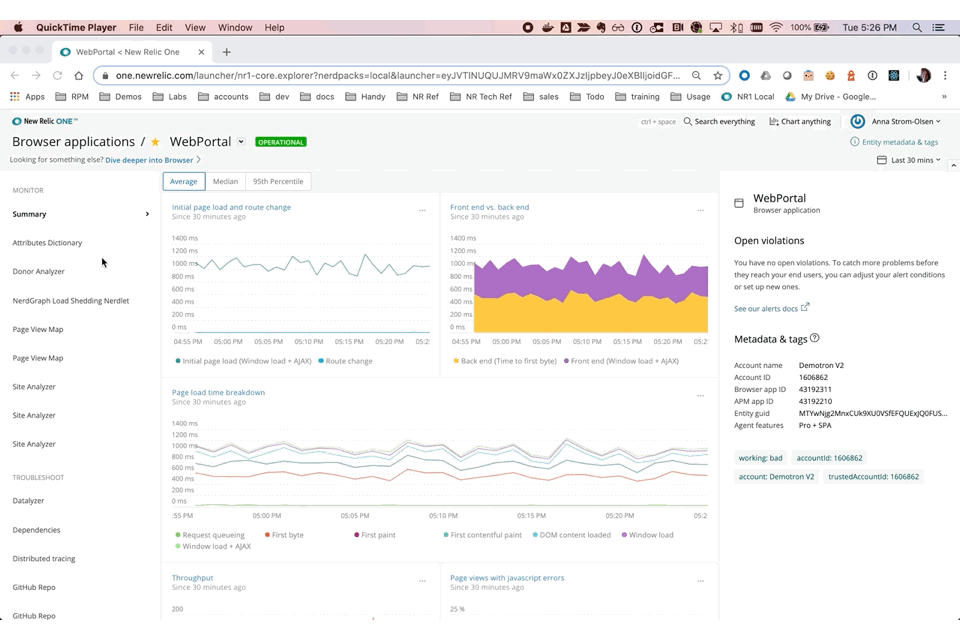

# Session Timeline
This nerdlet is designed to show all Browser events recorded over time against a single session. This is intended in particular to assist in use cases where a single customer raises an issue over a specific issue or help request. 

## Features
* Event stream of all browser events triggered by a specific session
* Gauge of events in elapsed time (ordered by time of occurence)
* Drilldown to see all attributes recorded for each event in the event stream
* Filter event stream to view only events of specific event types
* Define performance thresholds and flag events that breach those thresholds

## Installation
 - Download repo
 - run `npm install` 
 - run `nr1 nerdpack:uuid -gf`
 - update [config.js](/src/config/config.js) as needed (see `Configuration` below)
 - Serve locally with `nr1 nerdpack:serve` or [deploy](https://developer.newrelic.com/build-tools/new-relic-one-applications/publish-deploy) to your New Relic account using the `nr1` CLI.

## Configuration
Currently, app-specific configuration is hardcoded into the `/src/config/config.js` script, and changes will need to be made in this file at the moment. The following cofiguration attributes are available:

### duration
This is not set in the config.js script - the timeframe used for the search is derived from the common timepicker setting.

### searchAttribute
(*mandatory*) This is the attribute used to locate sessions. It is recommended to use a custom attribute such as userId (default) or email, but this can be any string value recorded into the root entity type (see `event` below)

### event
The root entity type that will be queried to locate sessions based on the `searchAttribute`. Defaults to `BrowserInteraction`.

### groupingAttribute
The attribute to use to locate related events across the in-scope set of event types (see `timelineEventTypes` below). Defaults to the `session` attribute. 

### timelineEventTypes
The set of event types to include in the timeline and event stream. These should be limited to [Browser event types](https://docs.newrelic.com/docs/insights/insights-data-sources/default-data/browser-default-events-insights#). Events will be located based on the `groupingAttribute`. Defaults to `BrowserInteraction`, `AjaxRequest` and `JavaScriptError`

### eventTitleAttributes
Each segment in the event stream can include an additional descriptive attribute (for instance, a URL or error message). Use these settings to indicate which attribute should be used. This config entry consists of an array containing the following object definitions:
* __name__: The event type (*mandatory*)
* __primary__: The attribute to first check for. If the value is null, fall through to the secondary attribute (*mandatory*)
* __secondary__: The attribute to check for if the primary value is null (*optional*)
* __truncateStart__: `true` to truncate the beginning of long values, `false` to truncate the end of long values. (*optional* - defaults to false if not included).

### eventThresholds
The thresholds each event will be assessed against. Events that breach any one of the defined thresholds are flagged in the UI. *Currently, thresholds only support numeric, and assume the comparison is greater than.* This config entry consists of an array containing the following object definitions:
* __eventType__: The target event type (*mandatory*)
* __thresholds__: An array of
  * __categoryAttribute__: scopes this threshold to event instances of a certain type. Use with `categoryValue` (*optional*)
  * __categoryValue__: scopes this threshold to event instances of a certain type. (*mandator* if `categoryAttribute` is provided)
  * __attribute__: the attribute to compare to the threshold (*mandatory*)
  * __threshold__: the threshold to compare the value against (*mandatory*)
